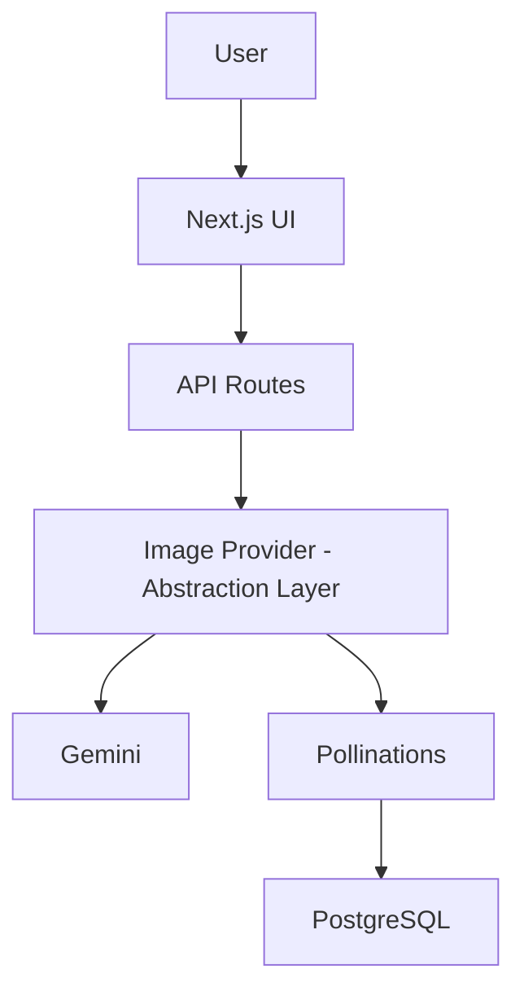

## Features

- Generate AI interior design concepts
- Persistent generation history
- Gallery view
- Reuse previous prompts
- Error handling
- Loading states
- PostgreSQL persistence

## Tech Stack

- Next.js 16
- TypeScript
- PostgreSQL
- Prisma
- React Query
- Tailwind CSS
- Pollinations API
- Vercel

## Architecture



# SETUP

## Environment

- Node v22.22

## Installation

```bash
npm install

cp .env.example .env

npx prisma generate

npx prisma db push

npm run dev
```

## Environment variables

NODE_ENV=
DATABASE_URL=
IMAGE_PROVIDER=

## Tradeoffs

- Pollinations was selected due to Gemini quota limitations.
- Provider abstraction allows easy migration to Gemini.
- Background job queues were intentionally omitted to keep the solution focused and deliverable within the assessment timeline.

## Future improvements

- Background jobs
- Cloudinary image persistence
- Authentication
- Rate limiting
- Caching
